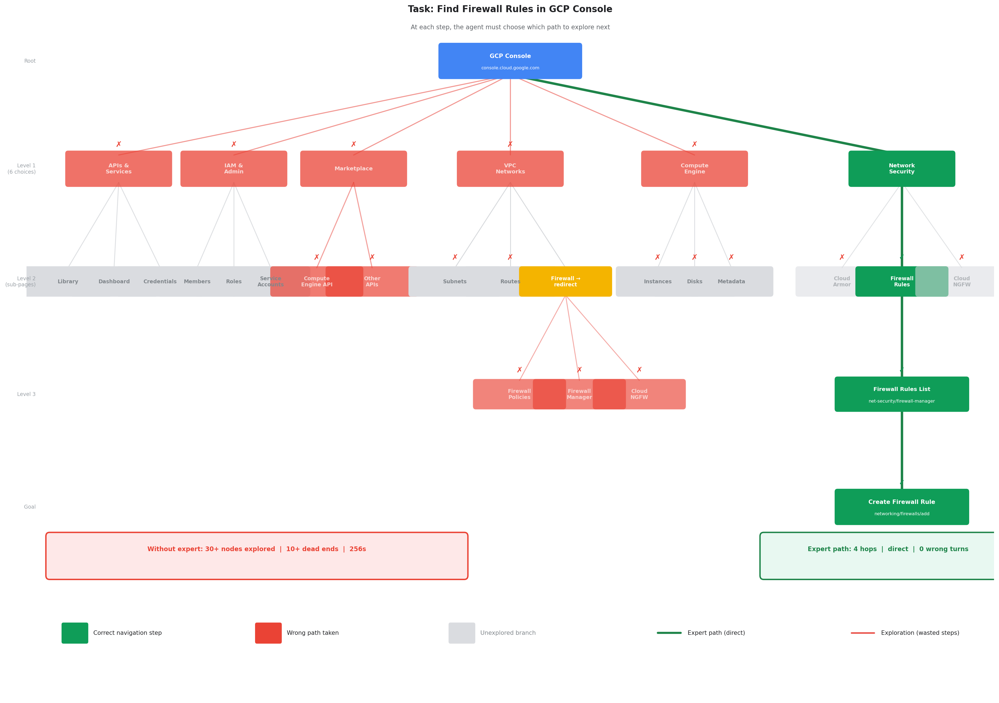
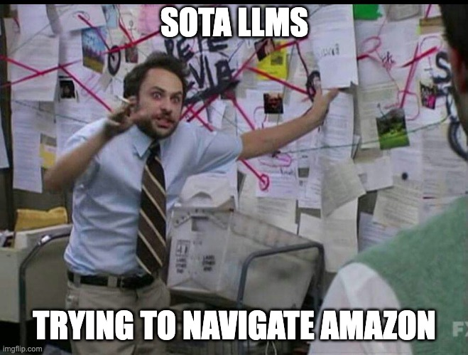
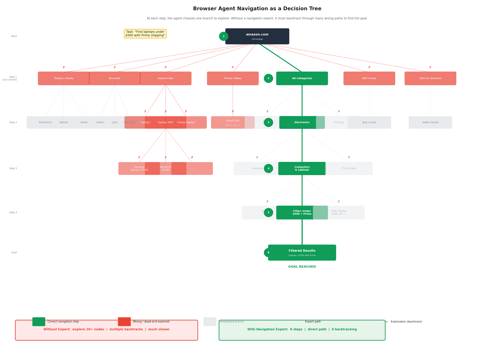
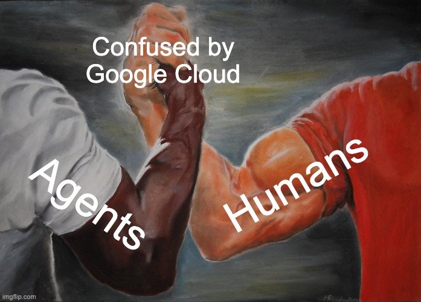
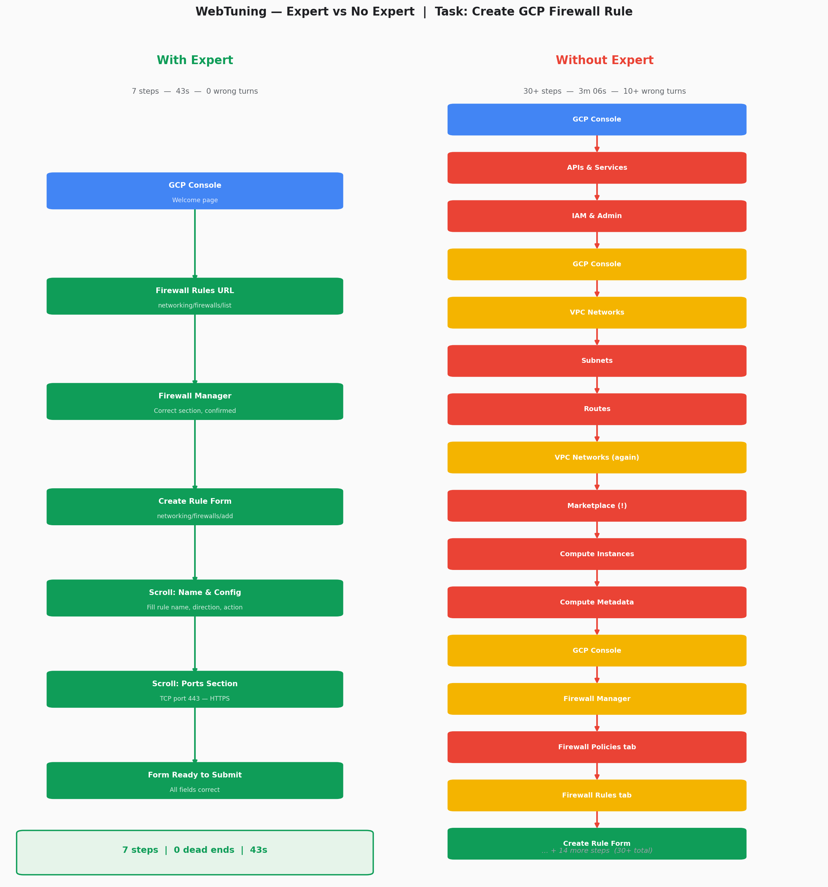

# WebTuning

> *Fine-tune a website-specific navigation expert. Make your browser agent 4× faster and eliminate wrong trajectories.*

## TL;DR

We built **WebTuning** — a pipeline that automatically trains a site-specific navigation expert for any website, then plugs it into a browser agent so the agent stops exploring and starts executing.

**How it works in one sentence:** Give it a URL and a list of things the model should know. The Auto Agent crawls the site with Playwright, generates training data, fine-tunes a Qwen/Qwen3-8B model on Pioneer, evaluates it, iterates, and registers the trained expert. From that point on, any browser agent that visits that domain gets instant, accurate navigation steps on its first tool call.

**Google Cloud Console — Create Firewall Rule:**

| | With Expert | Without Expert |
|---|---|---|
| Steps | **7** | 30+ |
| Time | **43 seconds** | 3 minutes 6 seconds |
| Wrong turns | **0** | 10+ (Marketplace, IAM, Cloud Armor, Subnets...) |

**Hacker News — Find noprocrast + user favorites:**

| | With Expert | Without Expert |
|---|---|---|
| Steps | **6** | 11 |
| Expert answer | ✅ Correct on step 1 | ❌ Must scrape FAQ + crawl profiles |
| Wrong turns | **0** | Full exploration required |



> 💡 *Click the image to view full screen — text is easier to read at full size.*

> *The green path is what the expert-assisted agent does. Every red node is a wrong turn the no-expert agent actually took.*

---

## Table of Contents

1. [Market Opportunity](#market-opportunity)
2. [Why Browser Agents Still Fail](#why-browser-agents-still-fail)
3. [The Decision Tree Problem](#the-decision-tree-problem)
4. [WebTuning: Site-Specific Navigation Experts](#webtuning-site-specific-navigation-experts)
5. [Demo 1 — Google Cloud Console](#demo-1--google-cloud-console)
6. [Demo 2 — Hacker News](#demo-2--hacker-news)
7. [Adaptive Fine-Tuning: The Model Gets Better Over Time](#adaptive-fine-tuning-the-model-gets-better-over-time)
8. [How It Works — Architecture](#how-it-works--architecture)
9. [Results](#results)
10. [Model IDs](#model-ids)
11. [Stack](#stack)

---

## Market Opportunity

Browser automation is one of the fastest-growing categories in enterprise software — and one of the least solved.

Convergence AI's acquisition by Salesforce in May 2025 is particularly telling — Salesforce paid to integrate adaptive browser agents directly into Agentforce because the problem of navigating complex UIs is real, recurring, and enterprise-critical.

**The problem is not solved.** Despite hundreds of millions in funding, the best browser agents still fail on ~40% of realistic tasks (WebArena SOTA: 61.7% in 2025). Production enterprise use requires 95%+ reliability. The gap is structural — and WebTuning directly addresses the root cause.

**The browser agent category is exploding with capital:**

| Company | Raised | Round | Date |
|---|---|---|---|
| **Browserbase** (Stagehand) | **$67.5M** at **$300M valuation** | Series B | June 2025 |
| **Adept AI** | **$415M** total | Series B | 2023 |
| **Simular** | **$27M** | Series A | Dec 2025 |
| **Browser Use** | **$17M** | Seed | March 2025 |
| **Convergence AI** | **$12M** → acquired by **Salesforce** | Pre-seed | Sept 2024 |
| **Skyvern** | $2.7M | Seed | Dec 2025 |

---

## Why Browser Agents Still Fail

LLMs are remarkable. They write production code, pass bar exams, debug complex systems, and reason through multi-step problems with near-human accuracy. But ask one to navigate a website it hasn't seen before — and it falls apart.

**This is not a model intelligence problem. It is a knowledge problem.**

When a browser agent opens Google Cloud Console for the first time, it has no idea that:
- Firewall Rules moved from *VPC Network* to *Network Security* in a recent UI update
- Clicking *Create* on the wrong tab opens an entirely different form
- The search bar finds docs and settings, not just pages
- Some services redirect to a Marketplace page until you manually enable the API

The agent must *discover* all of this through trial and error — clicking, backtracking, getting redirected, trying again. Even state-of-the-art models like Claude Sonnet and GPT-4o, which perform near-perfectly on coding benchmarks, web QA, and reasoning tasks, still fail routinely at browser navigation. The reasons are structural:

**1. Websites are not documented.** 

**2. Navigation is stateful and sequential.** 

**3. UI changes faster than training data.** 

**4. The exploration cost compounds.**

The result: browser agents today are notoriously inefficient, unreliable, and expensive on unfamiliar websites. Every session starts from zero.

---

## The Decision Tree Problem



The diagram below illustrates what a browser agent's trajectory actually looks like. At every step, the agent must choose one branch to explore. Without prior knowledge of the site, it has to backtrack through wrong paths repeatedly before finding the goal.



> 💡 *Click the image to view full screen — text is easier to read at full size.*

> *Task: "Find laptops under $500 with Prime shipping on Amazon." The green path is the optimal 6-step route. The red branches are the wrong turns an uninformed agent explores before finding it.*

---

## WebTuning: Site-Specific Navigation Experts

**WebTuning** solves this by pre-training a lightweight navigation expert for a specific website before the browser agent ever visits it.

The system works in three phases:

### Phase 1 — Crawl
Auto Agent (running in a Modal sandbox) receives a URL and a list of target skills. It:
- Installs Playwright and crawls 20–30 pages of the site
- Runs web searches to fill in knowledge the UI doesn't surface
- Generates 100–150 Q&A training pairs covering every target skill, including graceful declines for things the site genuinely doesn't support

### Phase 2 — Train
The Q&A pairs are uploaded to Pioneer as a decoder dataset. A `Qwen/Qwen3-8B` model is fine-tuned. The Auto Agent evaluates the model against a held-out test set, identifies failure patterns, and iterates — typically 2–5 training runs — until the model handles the site reliably.

### Phase 3 — Deploy
The trained model is registered in a local registry keyed by domain. Any browser agent that visits that domain can call `ask_website_expert(domain, question)` and receive instant, accurate navigation steps — without a single page load.

```
User submits URL + target skills
        │
        ▼
Auto Agent crawls site with Playwright (authenticated if needed)
        │
        ▼
Generates training data → uploads to Pioneer → fine-tunes Qwen3-8B
        │
        ▼
Evaluates on test set → iterates until model performs well
        │
        ▼
Navigation expert registered for domain
        │
Browser agent calls ask_website_expert() before any navigation
        └─► Gets exact URL + steps instantly → no exploration needed
```

---

## Demo 1 — Google Cloud Console



**Task: Navigate to Firewall Rules and open the Create Firewall Rule form.**

GCP Console is notoriously difficult to navigate. Its UI changes frequently, products move between menu sections, and many paths redirect to confusing intermediate pages. In this demo, Firewall Rules recently moved from *VPC Network → Firewall* to *Network Security → Firewall Policies* — a change that trips up both human users and AI agents.

### Trajectory Comparison



> 💡 *Click the image to view full screen — text is easier to read at full size.*

| | With Navigation Expert | Without Navigation Expert |
|---|---|---|
| **Steps** | **7** | **30+** |
| **Time** | **43 seconds** | **3 minutes 6 seconds** |
| **Wrong turns** | **0** | **10+** |
| **Dead ends** | None | Marketplace, Compute Engine, IAM, Cloud Armor, Subnets, Routes... |
| **Expert answer** | Immediate — correct URL on step 1 | SENTINEL — had to explore blindly |

Without the expert, the agent visited APIs & Services, IAM, VPC Networks, Subnets, Routes, accidentally ended up in the Compute Engine Marketplace (trying to enable an API it didn't need), bounced between Firewall Policies and Firewall Rules tabs multiple times, and visited Cloud Armor before finally finding the correct page.

### Videos

**With Navigation Expert — 7 steps, 43 seconds:**


▶ [Download full video](https://github.com/DhruvAtreja/webtuning/releases/download/v1.0-demo/demo_expert_7steps.webm)

**Without Navigation Expert — 30+ steps, 3 minutes 6 seconds:**


▶ [Download full video](https://github.com/DhruvAtreja/webtuning/releases/download/v1.0-demo/demo_no_expert_30steps.webm)

### Navigation Expert Training Results

| Metric | Value |
|---|---|
| Base model | `Qwen/Qwen3-8B` |
| Pages crawled | 31 |
| Training examples | 116 |
| Test set size | 33 questions |
| Training iterations | 2 |

**Quirks the model learned that the base model got wrong:**
- Firewall Rules are under **Network Security**, not *Networking* or *VPC Network*
- Project deletion uses **"Shut Down"** — not "Delete" — and has a 30-day recovery window
- IAM audit logs live under **IAM & Admin → Audit Logs**, not under *Logging Explorer*
- The URL pattern `?project=PROJECT_ID` works on any console page
- `console.cloud.google.com/networking/firewalls/list` redirects to the new Firewall Manager URL

### What the Expert Says

```
Q: How do I navigate to Firewall Rules in GCP Console?

A: 1. Go to Network Security (console.cloud.google.com/networking/firewalls/list).
   2. Or navigate via IAM & Admin → Network Security.
   3. Or use the search bar and type "Firewall Rules" to locate it.
   The page lists all ingress and egress rules with their target services,
   protocols, and allowed sources/destinations.
```

```
Q: How do I create a firewall rule to allow HTTPS traffic on port 443?

A: 1. Go to Network Security → Firewall Rules.
   2. Click Create Firewall Rule.
   3. Set Name to allow-https.
   4. Set Direction to INGRESS.
   5. Under Targets, select All instances in the network.
   6. Under Protocols and ports, enter tcp:443.
   7. Set Priority to 1000.
   8. Click Create.
```

---

## Demo 2 — Hacker News

**Task: Find the noprocrast feature and explain how to view a user's favorited posts.**

Hacker News has a deliberately minimal UI with almost no documentation. Features like `noprocrast`, `showdead`, and the `favorites?id=USERNAME` URL pattern are invisible — they exist only in profile settings and an obscure FAQ. There are no breadcrumbs, no search-and-discover UI, and no onboarding. A browser agent exploring from scratch has to scrape the FAQ, click through profile pages, and try URL patterns by trial and error.

### Results

| Metric | With Expert | Without Expert |
|---|---|---|
| **Steps** | **6** | 11 |
| **Expert answer on step 1** | ✅ Correct — noprocrast + favorites URL | ❌ SENTINEL |
| **Exploration needed** | Minimal — trusted expert | Full FAQ scraping + profile crawling |

### Navigation Expert Training Results

| Metric | Value |
|---|---|
| Base model | `Qwen/Qwen3-8B` |
| Pages crawled | 25 |
| Training examples | 138 |
| Test set size | 33 questions |
| Training iterations | 5 |

**Quirks the model learned:**
- Favorites: `news.ycombinator.com/favorites?id=USERNAME` — not linked anywhere in the UI
- `noprocrast` setting: enables a self-imposed time limit using `maxvisit` and `minaway` fields
- **501 karma** (not 500, not 1000) required to downvote comments
- Dark mode, following users, direct messages, notifications — **HN has none of these**
- Newest submissions: `/newest` — not discoverable through normal navigation

### What the Expert Says

```
Q: How do I enable noprocrast on Hacker News?

A: 1. Log in to your account.
   2. Click your username in the top-right corner.
   3. In your profile settings, find the noprocrast field and set it to yes.
   4. Set maxvisit to the number of minutes you want to browse per session.
   5. Set minaway to the number of minutes you must wait between sessions.
   6. Click update to save.
```

```
Q: How do I view a user's favorited posts on Hacker News?

A: 1. Go to news.ycombinator.com/favorites?id=USERNAME
   2. Replace USERNAME with the Hacker News username.
   3. This page is not linked from the user's public profile —
      you must construct the URL manually.
```

---

## Adaptive Fine-Tuning: The Model Gets Better Over Time

Every successful browser agent run is a training signal.

When `run_browser_agent` completes a task successfully, it appends the full trajectory — the sequence of tool calls and their outcomes — to a local JSONL file at `data/training/{domain}/trajectories.jsonl`. Each trajectory is formatted as a decoder Q&A pair:

```json
{
  "messages": [
    {"role": "system", "content": "You are a navigation expert for console.cloud.google.com."},
    {"role": "user", "content": "How do I: Create a firewall rule to allow HTTPS"},
    {"role": "assistant", "content": "1. [ask_website_expert] {...}\n2. [bash] Navigate to /networking/firewalls/add\n3. [bash] Fill form fields..."}
  ],
  "_meta": {"recorded_at": "2026-03-19T...", "job_id": "54bbff9b-..."}
}
```

These trajectories can be fed directly back to the **Auto Agent** as additional training data:

```
Browser agent completes task
        │
        ▼
Trajectory appended to data/training/{domain}/trajectories.jsonl
        │
        ▼  (periodically / on trigger)
Auto Agent receives: "Here are N new successful trajectories for {domain}.
Merge them with the existing training data, retrain the navigation expert,
and update the model registration."
        │
        ▼
New model version registered → browser agent uses updated expert
```

This creates a **flywheel**: the more tasks the browser agent completes on a domain, the more examples the navigation expert has seen, and the fewer wrong turns future agents make. The model doesn't just know what was explicitly taught during the crawl — it learns from every real session.

The browser agent traces are also sent to **LangSmith** (`auto-agent` project), giving full visibility into every LLM call, token count, tool use, and latency across both the browser agent and the auto agent training pipeline.

---

## How It Works — Architecture

```
┌─────────────────────────────────────────────────────┐
│                  WebTuning Pipeline                  │
│                                                       │
│  POST /webtuning/crawl                               │
│       │                                               │
│       ▼                                               │
│  Auto Agent (Modal sandbox)                          │
│  ├─ pip install playwright && install chromium       │
│  ├─ Crawl site (20-30 pages, authenticated)          │
│  ├─ web_search for domain knowledge                  │
│  ├─ Generate 100-150 Q&A training pairs              │
│  ├─ upload_dataset() → Pioneer                       │
│  ├─ start_training() → Qwen/Qwen3-8B                 │
│  ├─ Evaluate on test set → iterate                   │
│  └─ Write deliverables.json {domain, job_id}         │
│       │                                               │
│       ▼                                               │
│  Registry updated: domain → job_id                   │
└─────────────────────────────────────────────────────┘

┌─────────────────────────────────────────────────────┐
│                  Browser Agent Loop                  │
│                                                       │
│  run_browser_agent(url, task, job_id)                │
│  │                                                    │
│  ├─ Step 1: ask_website_expert(domain, question)     │
│  │     └─ HTTP → Pioneer inference (fine-tuned model)│
│  │          • Returns: numbered steps + exact URLs   │
│  │          • If unknown: "I don't have info on this"│
│  │                                                    │
│  ├─ If expert answered → execute steps directly      │
│  └─ If SENTINEL → explore with Playwright (bash)     │
└─────────────────────────────────────────────────────┘
```

---

## Results


> 💡 *Click the image to view full screen — text is easier to read at full size.*

> *Without the navigation expert, the agent must explore 30+ nodes across multiple levels before reaching the goal. With the expert, it takes the direct green path in 7 steps.*

The tree above visualises the core problem. At every level of GCP Console's navigation — from the top-level sidebar all the way down to the Create Firewall Rule form — the agent faces multiple possible choices. Without prior knowledge, it has to explore many of them, backtrack, and try again. The red nodes are wrong turns the no-expert agent actually took: APIs & Services, IAM, Marketplace (accidentally triggering an API enable flow), Compute Engine, Cloud Armor, Subnets, and Routes — before eventually landing on the right page.

With the navigation expert, the agent receives the correct path on its very first tool call and follows it directly. The green path through the tree is the only path it ever touches.

| | With Expert | Without Expert |
|---|---|---|
| GCP steps | **7** | 30+ |
| GCP time | **43s** | 3m 06s |
| Wrong turns | **0** | 10+ |
| First tool call | Expert answers immediately | SENTINEL — must explore |

The gains are largest on Hacker News (+30pp) because the base model had almost no site-specific knowledge to begin with — `noprocrast`, the `favorites?id=` URL pattern, and the 501 karma threshold are simply not in general training data. On GCP, the base model already knew most of the console structure (93.9%) but missed recent UI changes like the Firewall Rules relocation and the IAM audit logs placement — exactly the kind of drift that WebTuning is designed to fix continuously.

---

## Model IDs

| Domain | Model | Job ID | Platform |
|---|---|---|---|
| `news.ycombinator.com` | `hn-navigation-v5-qwen3-8b` | `f822a4f3-ebb7-4261-99ea-6cbf1e77a67c` | dev |
| `console.cloud.google.com` | `gcp-console-nav-v2-qwen3-8b` | `54bbff9b-c211-4749-b920-d21191dff94c` | dev |

---

## Stack

- **Auto Agent**: LangGraph + Claude Sonnet, Modal sandbox, Playwright
- **Training**: Pioneer platform, `Qwen/Qwen3-8B`, decoder fine-tuning
- **Browser Agent**: Anthropic SDK agentic loop, Playwright (local)
- **Tracing**: LangSmith (`auto-agent` project)
- **Auth**: Supabase JWT + Pioneer API keys
